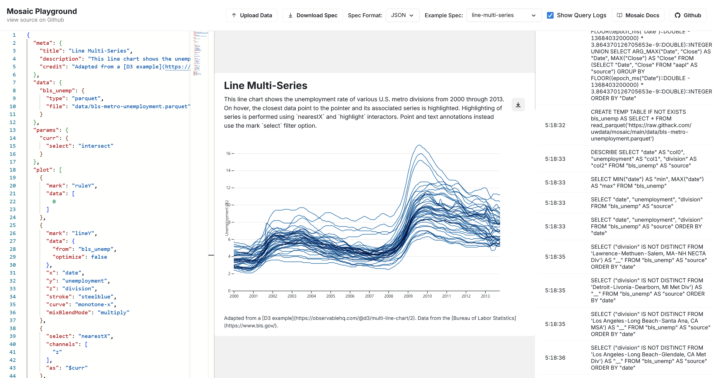

# Mosaic Playground

Edita y explora visualizaciones de [Mosaic](https://idl.uw.edu/mosaic/) en tu navegador. Inspirado en el [Vega Editor](https://vega.github.io/editor/#/).

Puedes subir tus archivos CSV, escribir especificaciones de visualización en JSON con autocompletado, ver cómo se actualiza tu visualización en tiempo real e interactuar con gráficos de conjuntos de datos grandes.

Características:
- Agrega o sube archivos locales CSV, Parquet o Arrow para visualizar
- Visualiza y edita especificaciones de ejemplo desde el sitio web de Mosaic
- Descarga especificaciones JSON o YAML y gráficos SVG o PNG
- Autocompletado para especificaciones JSON de Mosaic utilizando esquema JSON
- Admite especificaciones y ejemplos en JSON o YAML, permite cambiar entre los formatos mientras editas.
- Vuelve a renderizar el gráfico cuando cambia la especificación. Mantiene la última versión funcional cuando hay un error
- Visualiza las consultas subyacentes de DuckDB en el panel lateral
- Muestra errores (análisis de Mosaic, renderizado de Mosaic) como notificaciones (toasts) y en la consola
- Todas las visualizaciones se calculan localmente en tu navegador

Limitaciones:
- No admite formato ni autocompletado para especificaciones YAML (ver `issues.md` y el [error del proyecto principal](https://github.com/suren-atoyan/monaco-react/issues/228) con `@monaco-editor/react`)
- No muestra ciertos errores de consulta como `Binder Error: Referenced column "b" not found in FROM clause!` (probablemente porque están dentro de una promesa sin capturar, podría ser un problema con Mosaic)

Tareas pendientes:
- Admitir la subida de archivos JSON
- Simplificar el componente `UploadData`, tal vez usando `react-dropzone`.
- Extraer componentes como `MosaicProvider` y lógica como la función `exportChart` para que puedan ser utilizados por aplicaciones de terceros
- Agregar documentación con `typedoc`

## Utiliza

- [Mosaic](https://idl.uw.edu/mosaic/)
- [Observable Plot](https://observablehq.com/plot/getting-started)
- [DuckDB WASM](https://github.com/duckdb/duckdb-wasm)
- [duckdb-wasm-kit](https://github.com/holdenmatt/duckdb-wasm-kit)
- [@monaco-editor/react](https://github.com/suren-atoyan/monaco-react)
- [Chakra UI](https://chakra-ui.com/)
- [SaaS UI](https://saas-ui.dev/)
- [Vite](https://vitejs.dev/)
- [create-vite](https://github.com/vitejs/vite/tree/main/packages/create-vite)
- [SWC](https://swc.rs/)

## Licencia

Apache-2.0
