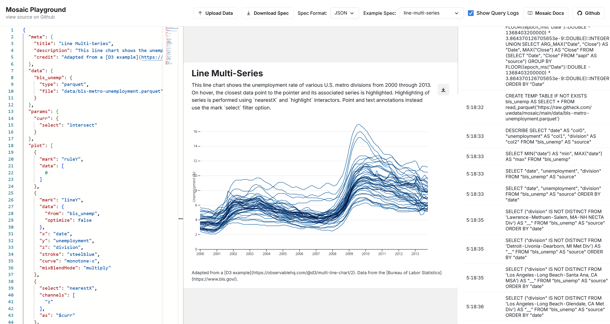

# Mosaic Playground

Edit and explore [Mosaic](https://idl.uw.edu/mosaic/) visualizations in your browser. Inspired by the [Vega Editor](https://vega.github.io/editor/#/).

Features:
- Re-renders chart whenever the specification changes. Keeps the last working version when there is an error
- Includes example specifications from the Mosaic website (loads latest versions directly from the Github repo)
- Download JSON or YAML spec and SVG or PNG of chart (doesn't include legends, parameters, or concatenated charts)
- Shows underlying DuckDB queries in side panel
- Shows errors (Mosaic parse, Mosaic render) as toasts and in the console
- Supports JSON or YAML specs and examples, can switch between the formats while editing.
- Support autocomplete for Mosaic JSON specs using JSON schema
- Add/upload local CSV, Parquet, or Arrow files to visualize
- All visualizations are computed locally in your browser

Limitations:
- Doesn't support formatting or JSON-schema autocomplete for YAML specifications (see `issues.md` and [upstream issue](https://github.com/suren-atoyan/monaco-react/issues/228) with `@monaco-editor/react`)
- Does not show certain query errors like `Binder Error: Referenced column "b" not found in FROM clause!` (probably because they are inside an uncaught promise, may be an issue with Mosaic)

TODOs:
- Support uploading JSON files
- Simplify UploadData component, maybe using `react-dropzone`.
- Refactor out components like MosaicProvider and logic like the exportChart function so it can be used by third-party apps
- Add docs with typedoc

## Uses

- [Mosaic](https://idl.uw.edu/mosaic/)
- [Observable Plot](https://observablehq.com/plot/getting-started)
- [DuckDB WASM](https://github.com/duckdb/duckdb-wasm)
- [duckdb-wasm-kit](https://github.com/holdenmatt/duckdb-wasm-kit)
- [@monaco-editor/react](https://github.com/suren-atoyan/monaco-react)
- [Chakra UI](https://chakra-ui.com/)
- [SaaS UI](https://saas-ui.dev/)
- [Vite](https://vitejs.dev/)
- [create-vite](https://github.com/vitejs/vite/tree/main/packages/create-vite)
- [SWC](https://swc.rs/)

## License

Apache-2.0
